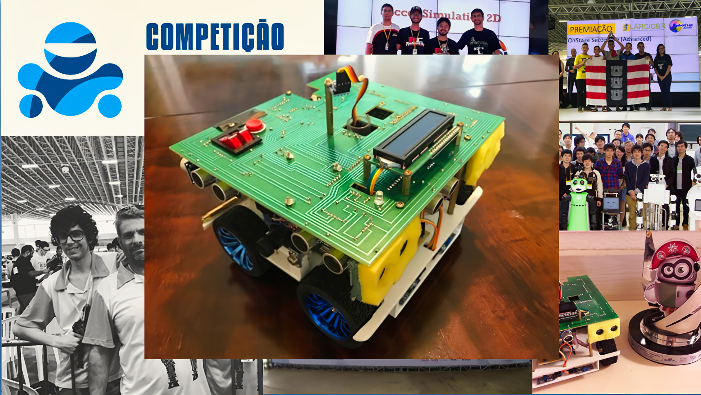
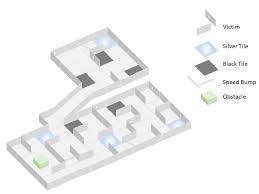
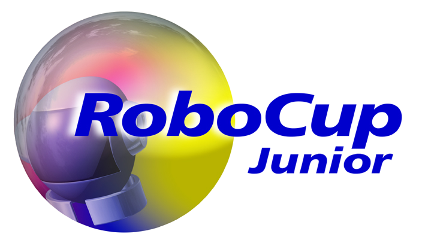

# ENNARD - RoboCup Rescue Maze 2018
###### Autonomous navigation and victim-identifying robot, created to compete in RoboCup Junior Brazil Open 2018. The robot achieved 1st place out of 17 at the category, claiming the title of national champion.

### 

## Rescue Maze Preface

Rules can be found at: https://junior.robocup.org/rcj-rescue-maze/

" The robot needs to search through a maze for victims. The robot should not find the fastest path through the maze, instead it should explore as much of the maze as possible . The robot will get points for each victim found and will deliver a rescue kit close to the victim. The robot must avoid areas with a black floor.

Rescue Maze sub-league open to students from age 13 up to and including 19 years of age (age as of 1st of July).Team members may compete in Rescue Line twice (2 international events). After competing in Rescue Line twice, they must move to Rescue Maze. "

## CAD Models

The folder 'models' contains all 3D files used and made during the prototyping/simulation phase of the project, using AutoCAD 2017.  Drawing-SALLES_X.dwg refers to different versions of the robot concept, while pá_X.dwg is a custom servo shovel design to facilitate rescue kit dropping. 

All printable files are in .stl files, and they are mechanically self-sufficient for the static assembly of the entire robot structure (aside from screws, standoffs, etc.).

## Hardware Components

The robot consists of:

1. 1x Arduino DUE microcontroller ARM board
2. 2x OpenMV Cam M7 machine vision boards (UART communication with the Arduino)
3. 4x Pololu 25D 12V HP metal gearmotors with 47:1 reduction (210RPM)
4. 4x Rotary hall-effect motor encoders
5. 4x Rubber wheels
6. 9x HC-SR04 ultrassonic rangefinder sensor modules
7. 2x MLX90614 infrared temperature sensor modules
8. 1x MPU6050 accelerometer sensor module
9. 1x HMC5883l magnetometer sensor module
10. 2x TCRT5000 active light reflectance sensor modules
11. 1x 16x2 segments LCD display with blue backlight
12. 1x Digital arcade button
13. 2x 12V LiPO batteries

## Team Description Paper 

In order to attend the Latin American Robotics Competition, every team must submit a TDP which shows the engineering strategies implemented. The following text (written in Brazillian Portuguese) summarizes these points in the IEEE text format: 'TDP' ---> TDP.pdf / TDP.docx

## Software

Code that is run during scored runs is stored in the 'ENNARD' folder. ENNARD.ino is the main C++ script, while low-level component interactions are handled by each header file.

'TestModes' contains debugging scripts for each component, and 'Cams' contains the multiple strategies tested for the identification of the new "Visual victims" (H, S and U letters), including template matching and blob segmentation.  

## Video Material

A few proof-of-concept videos were produced:

* Final version of the lower part of the chassis ---> https://www.youtube.com/watch?v=Bfc4bDW7wJo

- Wall Alignment (top view) ---> https://www.youtube.com/watch?v=RuqlHey5neY

- Wall Alignment (side view) ---> https://www.youtube.com/watch?v=VqffBqsZt2Q

- PID Control and ramp negotiation ---> https://www.youtube.com/watch?v=kQnzG5W4b-0

- Mecanum omnidirectional wheels (later changed to rubber wheels) ---> https://www.youtube.com/watch?v=znJ_pU6Sihw

## Where to Find Me:

* Email: felipe_catapano@yahoo.com.br
* [Telegram Contact 🔵](https://t.me/mekhyw)
* [Twitter Page 🐦](https://twitter.com/MekhyW)

